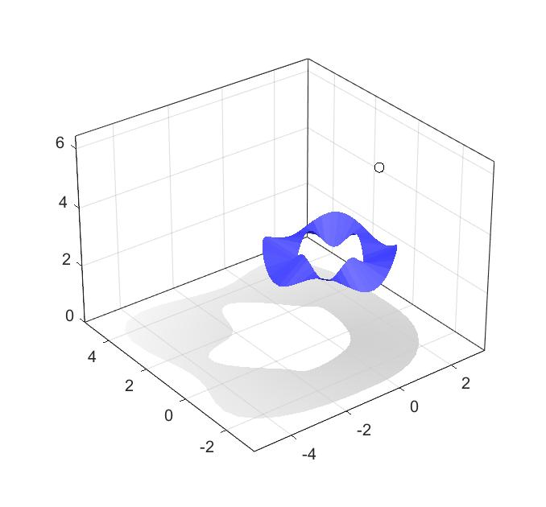
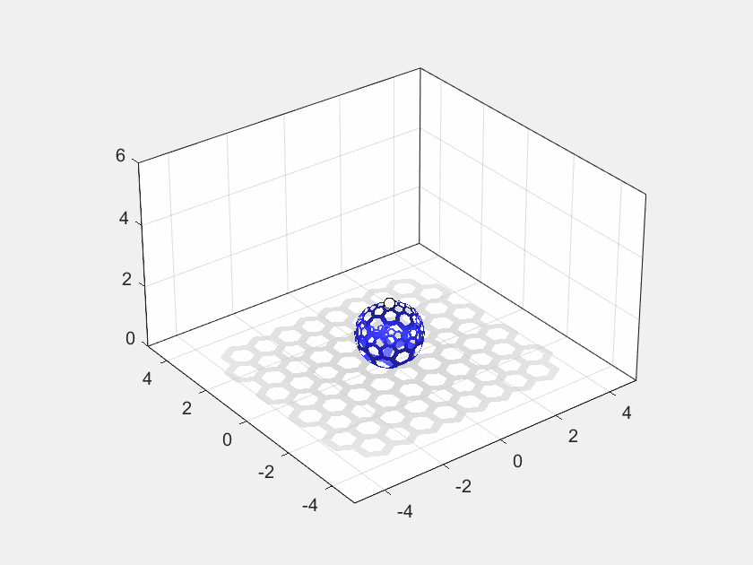

# Shadows for MATLAB&reg;

Algorithms for computing and drawing shadows that are cast by a
triangulation.  The computed shadows work well when they are drawn on
the "walls" of an axes.  Several utilities are provided depending on
the shadow needed.

A triangulation holds the geometry of the thing that will be casting
the shadow.  The function `tri2shadow` will compute a shadow
projection against an Axes wall for a given light location.

The utilities `triMeshShadow` and `triMeshShadow3` will accept a
triangulation and light location, and draw the triangulation, the
shadow, and the light in an axes.   `triMeshShadow` will only draw on
the floor of the axes.  `triMeshShadow3` will draw shadows on all
visible walls of the Axes.

In addition, this repo contains examples on building triangulations
that cast interesting shadows (see examples.) 

## Examples

Draw a shadow using `triMeshShadow`.

    sz=50;
	t=linspace(0,2,sz)';
	x=cospi(t);
	y=sinpi(t);
	z=cospi(t*4)/3;
	tri = triangulation([ 1:sz; 2:sz 1; [2:sz 1]+sz; (1:sz)+sz ]',...
	                    [x y z+3; x*2 y*2 -z+3]);
	triMeshShadow(tri);

See  `Examples_ProjectingShadows.mlx` for details:

Compute a projection of a desired shadow onto a sphere using `ps2stereographicsphere`.

	[tri, lz] = ps2stereographicsphere(shapegrid(5,4,'Radius',.75));
    triMeshShadow(tri, [0 0 lz], 'Attenuation',8);

See `Examples_StereographicProjections.mlx` for details.

Compute shadow projections on all 3 walls of the axes, and animate the light through
the scene.

	[tri, lz] = ps2stereographicsphere(hexgrid);
    H=triMeshShadow3(tri, [0 0 lz], 'Attenuation',8);
	drawnow
	H.updateShadows([0 0 lz-.5]);

See `Examples_animation.m` for details.

Create STL files of some tiled polygon shapes stereographicly projected onto a sphere.

    makeShadowModels;
	
### MathWorks&reg; Products (https://www.mathworks.com)

- Partial Differential Equasion Toolbox&trade; will be used for
  meshing polyshapes if it is installed.

## License

The license is available in the License.txt file in this GitHub repository.

Copyright 2024 The MathWorks, Inc.
